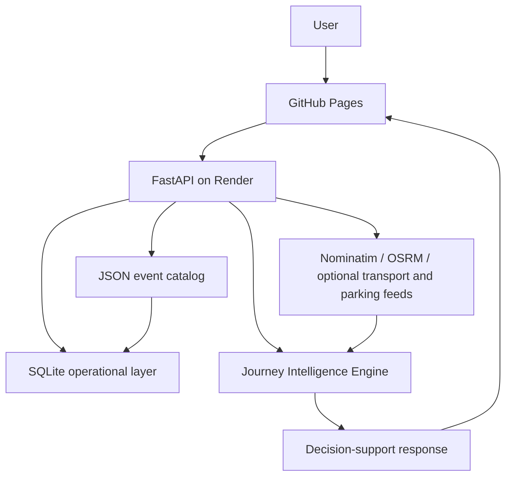

# Event Travel Intelligence

**Turning event conditions, routing data and transport intelligence into practical journey decisions**

A data analytics, decision-intelligence and Python/API engineering case study.  
Production-verified Phases 1–6 · API version 1.6.0

---

## 1. Executive Summary

Large events can change ordinary travel conditions. A standard route planner can return a normal driving time. It does not usually explain event-specific delay, crowd pressure, verified disruptions, Park & Ride access, or the risk that a return journey crosses midnight.

Event Travel Intelligence is a deployed decision-support platform for those journeys. It combines geospatial services, a configurable event catalog, rules-based journey modelling, structured disruption records, and optional live transport or parking feeds.

The public system is live:

- Application: [GitHub Pages](https://aboladvisuals.github.io/event-travel-intelligence/)
- API: [Render / FastAPI](https://event-travel-intelligence.onrender.com/)
- Source: [GitHub](https://github.com/aboladvisuals/event-travel-intelligence)

Events are configuration, not hardcoded product logic. The current production case is the NSPPD UK Prayer Conference at Old Trafford. Other catalog events can be selected without rewriting the engine.

Modelled intelligence and measured live data are kept apart. The public deployment does not invent live traffic speeds or live parking occupancy.

---

## 2. The Real-World Problem

**Case:** NSPPD UK Prayer Conference, Old Trafford, Manchester, 26 September 2026.

| Condition | Configured fact |
| --- | --- |
| Capacity | 50,000 |
| Event window | 11:30–21:00 |
| Traffic-management window | 11:30–21:00 |
| Venue | Old Trafford, Manchester, UK |
| Configured disruptions | Event traffic around Old Trafford; M60 Simister Island (J17–J18) closure 26–28 September 2026 |
| Park & Ride options | Ladywell, Parkway, Sale Water Park |

The planning problem is not “what is the usual drive from A to B?”

People travel from arbitrary UK origins. An 08:00 outbound trip can miss the traffic-management window entirely. A 21:30 return can still sit in post-event dispersal and arrive after midnight. Park & Ride is not a single duration: it is drive time plus a transfer. A route card that only shows OSRM minutes hides those differences.

A generic duration is insufficient because it does not answer whether the event is expected to change the journey, whether configured disruptions apply, whether return risk is higher than outbound risk, or whether any *measured* live data exists.

---

## 3. The Analytical Question

The product is built around explicit questions:

1. What is the normal route (distance and OSRM duration)?
2. How do configured event windows change expected travel conditions?
3. What additional event-related delay should be modelled?
4. What is the estimated arrival time?
5. What is the return-journey risk, including day rollover?
6. Are there verified or configured disruptions?
7. What Park & Ride options exist, and what is total access time?
8. Is measured live traffic or live parking occupancy actually available?

If the answer to (8) is no, the system must say so.

---

## 4. Solution

The platform is a layered decision engine, not a single “live traffic” number.

| Layer | Role | Source of truth |
| --- | --- |
| Normal route | Distance, duration, geometry | Public OSRM |
| Event intelligence | Windows, capacity, impact rules | Versioned JSON event catalog |
| Journey intelligence | Outbound/return breakdown, risk, overnight handling | Rules-based engine (`backend/travel_engine.py`) |
| Verified disruption | Structured records on the event | Event catalog (labelled configured, not live) |
| Live transport | Optional measured delay / structured closures | Licensed or provider feeds when keys exist |
| Parking | Drive + transfer access; optional occupancy | Event sites + official occupancy feed when available |

Unavailable live data stays unavailable. The event-adjusted estimate continues without fabricating a live minute count or an occupancy state.

---

## 5. Architecture

The JSON event catalog (`data/events/*.json`) remains the reviewed source of truth. SQLite holds an operational copy, cache rows and source metadata.



```
User
  → GitHub Pages
    → FastAPI / Render
      → Event JSON catalog + SQLite operational layer
        → Geocoding / Routing / Transport / Parking services
          → Journey Intelligence Engine
            → Decision-support response
```

If the public API is blocked, the static frontend can still load local catalog files and compute an event-adjusted route with Nominatim and OSRM. That fallback reports live traffic as unavailable.

---

## 6. Data & External Services

| Service | Use in this system | Live measured journey/occupancy on public deploy? |
| --- | --- |
| Nominatim | UK-biased geocoding (`countrycodes=gb`) | No — locations only |
| OSRM | Normal driving route, duration, geometry | No — routing estimate, not live speeds |
| Leaflet / OpenStreetMap | Map presentation | No |
| National Highways WebTRIS | Reachability / traffic-count check | No — not origin–destination speeds |
| TfGM travel-updates page | Reachability check only | No — HTML is not scraped into incidents |
| National Highways closures API | Structured live closures | Only with `NATIONAL_HIGHWAYS_SUBSCRIPTION_KEY` |
| TfGM alerts / car-parks APIs | Alerts and occupancy | Only with `TFGM_API_KEY` |
| TomTom routing | Measured delay vs no-traffic route | Only with `TOMTOM_API_KEY` |
| JSON event catalogue | Events, windows, disruptions, P&R sites | Configuration |
| SQLite | Operational store and persistent cache | Platform state |

Public and free feeds have hard limits. There is no suitable keyless UK source for measured origin-to-destination speeds. TfGM occupancy requires a key; without it `api.tfgm.com/odata/carparks` is forbidden. Live `/health` on the public API reports TomTom, National Highways and TfGM keys as unset.

---

## 7. Analytical Logic

This is a **rules- and model-based decision engine**, not a machine-learning model.

**Normal route duration** is the OSRM driving time.

**Event-adjusted estimated duration** applies the selected event’s window rules:

```
estimated_minutes = round(normal_OSRM_minutes × event_factor + extra_event_delay)
```

**Journey breakdown** (live traffic minutes are a separate optional term):

```
Normal route
+ Event impact   (from the factor, during the relevant window)
+ Additional delay
[+ Live traffic minutes only if a measured feed returns them]
= Estimated journey
```

Outbound windows for the NSPPD configuration:

| Departure relative to the event | Factor | Extra delay | Risk label |
| --- | --- |
| Before build-up (early) | 1.00 | 0 | LOW — Normal / early departure |
| Build-up | 1.15 | 0 | MODERATE |
| Main event period | 1.35 | 0 | HIGH |
| Dispersal | 1.25 | 0 | HIGH |

Return journeys use a separate scenario. Leaving while the event is still active or during peak dispersal adds both a higher factor and extra delay. After the traffic-management end, a post-event rule can still apply.

**Crowd risk** is scored from configured capacity and whether the departure sits inside the traffic-management window. Capacity ≥ 40,000 contributes to the score. It is not a live crowd sensor.

**Overnight / day rollover** compares calendar dates of departure and modelled arrival. A return that lands after midnight is labelled `+1 day`.

OSRM alternatives are shown only when the router returns them. They are never invented.

---

## 8. Example Analysis

Verified against `POST /analyze` on the live API, 26 September 2026.

OSRM durations can move slightly as the public router updates. The figures below are the production response for this origin and these clock times.

| Field | Value |
| --- | --- |
| Origin | Kingston upon Hull (resolved: Kingston upon Hull, Hull and East Yorkshire, England, United Kingdom) |
| Destination | Old Trafford, Manchester, UK |
| Event | NSPPD UK Prayer Conference, 26 September 2026 |
| Outbound departure | 08:00 |
| Return departure | 21:30 |

### Outbound (early departure)

| Metric | Production value |
| --- | --- |
| Distance | 106.1 miles |
| Normal route (OSRM) | 123 min |
| Event impact | 0 min |
| Additional delay | 0 min |
| Live traffic | Unavailable (`live_traffic_available`: false) |
| Estimated journey | 123 min |
| Arrival | 10:03 |
| Travel risk | LOW — Normal / early departure |
| Crowd risk at this departure | MODERATE (large capacity; outside the traffic-management period) |

An 08:00 start is before the event window, so the estimate equals the normal route. The product still makes that explicit instead of collapsing everything into one “ETA”.

### Return (post-event)

| Metric | Production value |
| --- | --- |
| Distance | 105.8 miles |
| Normal route (OSRM) | 123 min |
| Event impact | 43 min |
| Additional delay | 50 min |
| Live traffic | Unavailable |
| Estimated journey | 216 min |
| Arrival | 01:06 (+1 day) |
| Day rollover | Yes |
| Travel risk | HIGH — Heavy post-event traffic |

Same corridor, different decision: leaving at 21:30 is not the same journey as leaving at 08:00.

### Configured disruptions (not live)

- NSPPD Old Trafford event traffic management — 11:30–21:00 — source TfGM — status **configured**
- M60 Simister Island closure, J17–J18 — 26–28 September 2026 — source TfGM — status **configured**

### Park & Ride access (occupancy unknown)

| Site | Drive | Transfer | Total access | Occupancy |
| --- | --- |
| Ladywell Park & Ride | 115 min | 25 min | 140 min | Unknown / No live occupancy feed |
| Parkway Park & Ride | 125 min | 25 min | 150 min | Unknown / No live occupancy feed |
| Sale Water Park Park & Ride | 124 min | 20 min | 144 min | Unknown / No live occupancy feed |

Access time is drive plus transfer. Occupancy is not inferred from those times.

This response included one OSRM route. Alternatives are not displayed unless the router supplies them.

---

## 9. Live Data Honesty

The main design rule is data quality: **do not present a model as a measurement.**

- OSRM provides a routing estimate.
- Event impact is modelled from configured windows and factors.
- Verified disruptions are separate structured records, labelled configured.
- Live traffic minutes are applied only when a supported provider returns measured delay.
- Live parking occupancy is shown only when an official feed returns a state for that facility.
- When those feeds are missing, failed or stale (older than 15 minutes), the API reports **Unavailable** or **Unknown / No live occupancy feed**.

On the public instance, `/health` reports `tomtom`, `national_highways` and `tfgm` keys as false. WebTRIS being reachable is not treated as a journey-time feed. TfGM page HTML is not scraped into incidents.

That honesty is the product. A recruiter or client can trust the breakdown because each layer is named.

---

## 10. Production Engineering

This is a deployed service, not a notebook.

| Concern | Implementation |
| --- | --- |
| API | FastAPI (`backend/main.py`) |
| Hosting | GitHub Pages (UI) + Render (API) |
| Catalog | Versioned JSON events |
| Operational store | SQLite (`events`, disruptions, parking, cache, source metadata) |
| Cache | Memory + SQLite; Redis only if `REDIS_URL` is set |
| Rate limiting | Per-IP windows (`/analyze` 20, `/events*` 60, live endpoints 30) |
| CORS | `ALLOWED_ORIGINS` and `*.github.io` |
| Health / ready | `GET /health`, `GET /ready` |
| Logging | Structured JSON; start locations not logged |
| Validation | Pydantic; analyze times must be `HH:MM` |
| Degradation | Works without live keys; UI can fall back to local catalog |
| Secrets | Environment only; `/health` exposes key presence, not values |
| Errors | Stack traces hidden unless `DEBUG_ERRORS=true` |
| Tests | 51 automated tests |

Live API version: **1.6.0**. Status on check: healthy and ready.

---

## 11. Testing & Validation

Counts taken from the current repository test modules:

| Suite | Tests |
| --- | --- |
| Event engine | 7 |
| Event discovery | 8 |
| Journey intelligence | 5 |
| Live transport | 10 |
| Parking | 10 |
| Platform | 6 |
| API | 5 |
| **Total** | **51** |

```bash
PYTHONPATH=. python tests/run_all.py
```

Production verification covered event discovery and selection, UK-biased geocoding, journey analysis, route geometry and the Leaflet map, transport and parking fallbacks, input validation, overnight arrivals, `/health` and `/ready`, and Pages-to-API compatibility.

---

## 12. Results

No user counts or ROI figures are claimed. The deployed system demonstrates that it can:

- turn a generic route into event-aware journey intelligence
- accept arbitrary UK origins
- keep normal routing separate from event impact
- analyse outbound and return under different window rules
- surface Park & Ride access times
- handle overnight / next-day arrivals
- expose structured JSON for every layer
- keep working when live external feeds are unavailable

For Hull at 08:00 the event model correctly adds nothing. For the 21:30 return it adds 43 minutes of event impact and 50 minutes of extra delay, and flags a next-day arrival. That contrast is the decision the product exists to show.

---

## 13. What I Learned

- Data quality matters more than apparent complexity. A correct “Unavailable” is more useful than a confident invented speed.
- External APIs come with licensing, rate limits and coverage gaps. The product has to survive those gaps.
- Modelled and measured data must be named separately in the interface and the payload.
- Graceful degradation is part of the analysis, not an afterthought.
- A production analytics service needs validation, observability, caching and rate limiting as well as the model.
- A useful analytics product is both analytical logic and engineering: catalog, engine, API, UI, tests, deploy.

---

## 14. Limitations

- No free keyless UK origin-to-destination measured-speed feed
- Live traffic requires supported provider credentials
- Live parking occupancy requires a reliable official feed
- Public OSRM may return only one route
- SQLite on free Render storage is operational and can be ephemeral
- Nominatim may rate-limit; coordinates are cached and 429s retried
- Destination is the selected event venue, not an arbitrary second user destination
- Suitable for current portfolio / MVP scale, not unlimited multi-instance traffic

---

## 15. Future Opportunities

Not implemented on the public deployment:

- Licensed traffic feeds on the live instance
- Official live parking occupancy on the live instance
- Managed PostgreSQL
- Redis in production (supported in code if configured)
- Background refresh jobs
- Additional event APIs
- Multi-instance deployment
- Richer demand / arrival modelling

---

## 16. Project Evolution

| Phase | Scope | Status |
| --- | --- |
| Phase 1 | Dynamic Event Engine | Completed ✓ |
| Phase 2 | Event Discovery & Selection | Completed ✓ |
| Phase 3 | Advanced Journey Intelligence | Completed ✓ |
| Phase 4 | Live Transport Intelligence | Completed ✓ |
| Phase 5 | Live Parking Intelligence | Completed ✓ |
| Phase 6 | Production Platform & Scalability | Completed ✓ |

All six phases are production-verified on the public Pages + Render deployment.

---

## 17. Links

- **Live demo:** https://aboladvisuals.github.io/event-travel-intelligence/
- **GitHub:** https://github.com/aboladvisuals/event-travel-intelligence
- **API:** https://event-travel-intelligence.onrender.com/
- **Technical README:** [README.md](./README.md)
- **Platform notes:** [PLATFORM.md](./PLATFORM.md)
