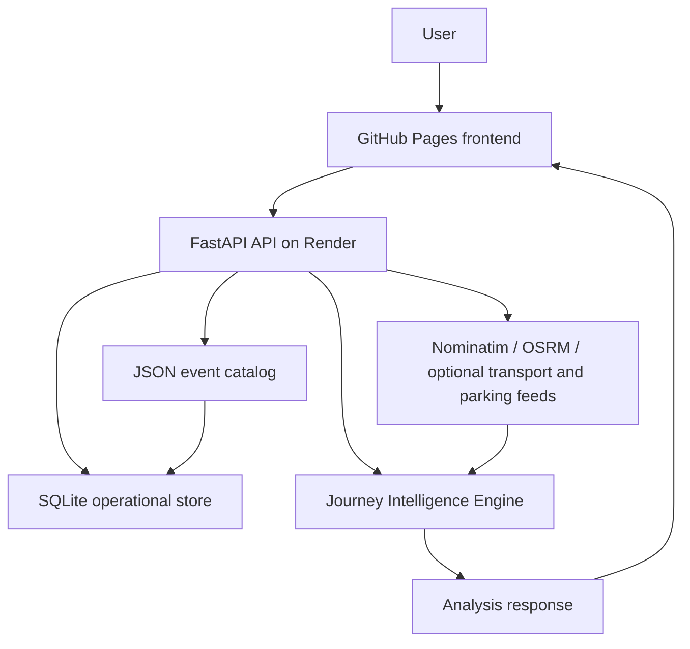

# Event Travel Intelligence

Event Travel Intelligence is a full-stack travel intelligence and decision-support platform for journeys to major events. It combines UK-biased geocoding, driving routes, a versioned event catalog, event-adjusted timing, crowd-risk modelling, verified disruption records, Park & Ride access analysis, and optional live transport or parking feeds when a real source is configured.

The public deployment is production-verified through Phases 1–6. Modelled intelligence (event windows, extra delay, crowd risk, access times) is always separate from measured live data. Live traffic speeds and live parking occupancy are not invented.

## Live Demo

| Resource | URL |
| --- | --- |
| Live application | https://aboladvisuals.github.io/event-travel-intelligence/ |
| API | https://event-travel-intelligence.onrender.com/ |
| GitHub repository | https://github.com/aboladvisuals/event-travel-intelligence |

Current public API version: **1.6.0**.

## Problem

Large events create unusual travel conditions that ordinary route planners do not model well: traffic-management windows, extra delay near the venue, crowd pressure, road restrictions, and uncertain Park & Ride access.

People travelling from different UK towns need one place to understand:

- the normal driving route
- how the selected event is expected to change that journey
- verified or configured disruptions
- outbound and return timing, including overnight arrival
- Park & Ride drive, transfer and total access time
- whether any *measured* live traffic or occupancy data is actually available

## Solution

The system keeps event configuration separate from the travel engine.

- **Geocoding** — Nominatim, UK-biased (`countrycodes=gb`)
- **Routing** — public OSRM driving routes, with alternatives and GeoJSON only when the router returns them
- **Dynamic event configuration** — versioned JSON catalog (`data/events/*.json`) is the source of truth
- **Event-adjusted journey modelling** — traffic-management windows and extra delay from the selected event
- **Crowd-risk modelling** — capacity and window from the event record
- **Disruption information** — configured/verified records, labelled as configured, not live
- **Journey breakdown** — normal + live (if measured) + event impact + extra delay
- **Route comparison** — only when OSRM supplies alternatives
- **Mapping** — Leaflet + OpenStreetMap tiles
- **Transport intelligence** — four-layer model with an honest unavailable state
- **Park & Ride analysis** — access times always; occupancy only from an official feed

## Key Features

- Dynamic event engine (events are data; the engine is reusable)
- Event discovery and search (name, venue, city, country)
- Arbitrary UK origin support
- UK-biased Nominatim geocoding with cache and 429 retry
- OSRM route analysis (distance, duration, geometry)
- Outbound and return journey intelligence
- Event impact modelling from configured windows
- Journey time breakdown
- Route alternatives when the routing provider returns them
- Leaflet map (origin, destination, route, Park & Ride sites)
- Crowd-risk modelling
- Verified/configured disruptions
- Live transport layer with graceful unavailable state
- Park & Ride access analysis (drive, transfer, total)
- Live parking layer with unknown/unavailable fallback
- Overnight arrival / day-rollover handling
- API health and readiness endpoints
- Persistent cache (memory + SQLite; Redis optional)
- Per-IP rate limiting
- Structured JSON request logs
- SQLite operational store
- Graceful degradation if live feeds or the API are unavailable

The fictional `test-event-manchester` record is development-only. It proves the engine reads configuration dynamically and must not be presented as a real event.

## Architecture

The versioned JSON event catalog remains the source of truth. SQLite holds an operational copy plus cache and source metadata.



```
User
  ↓
GitHub Pages frontend
  ↓
FastAPI API on Render
  ↓
Event JSON catalog + SQLite operational layer
  ↓
Geocoding / Routing / Transport / Parking providers
  ↓
Journey Intelligence Engine
  ↓
Analysis response
```

Frontend fallback: if the public API is blocked, the UI can use same-origin `events.json` / `event.json` and still calculate an event-adjusted route with Nominatim + OSRM. That local fallback reports live traffic as unavailable.

Relevant modules:

| Layer | Location |
| --- | --- |
| Event schema | `backend/event_model.py` |
| Event store | `backend/event_store.py` |
| Travel engine | `backend/travel_engine.py` |
| Live transport | `backend/live_transport.py` |
| Parking | `backend/parking_intelligence.py` |
| Cache / SQLite | `backend/cache.py`, `backend/db.py` |
| API | `backend/main.py` |

Adding another event means adding event data, not rewriting the travel engine.

## Journey Intelligence

After an event is selected, analysis is more than a single duration.

1. **Normal route duration** — OSRM driving time.
2. **Event impact** — configured traffic-management factor during the event window (zero outside that window).
3. **Additional delay** — extra minutes from the event record when the journey falls in a peak window.
4. **Estimated journey** — `round(normal_OSRM_minutes * event_factor + extra_event_delay)`, plus measured live minutes only when a live feed actually returns them.
5. **Return journey** — same model using the event’s traffic-end window and the requested return time.
6. **Day rollover** — overnight arrivals keep an explicit next-day format.

OSRM alternatives are displayed only when the routing provider returns them. They are never invented.

Example when live speed data is missing (the public default):

```
Normal route:      123 min
Live traffic:      Unavailable
Event impact:      +25 min
Estimated journey: 148 min
```

Example only when a measured live delay exists:

```
Normal route:      123 min
Live traffic:      +18 min
Event impact:      +25 min
Estimated journey: 166 min
```

The OSRM duration is never silently replaced.

## Live Transport Intelligence

Four layers, kept distinct:

1. **Normal route** — OSRM.
2. **Event model** — configured event conditions.
3. **Verified disruption** — configured/verified disruption information from the event store.
4. **Live traffic/transport** — only when a real supported feed provides data.

The current public deployment does **not** fabricate live traffic speeds. Licensed or provider credentials can enable supported live feeds through environment variables.

| Source | What it provides here | Key required? |
| --- | --- |
| OSRM public router | Normal driving time and geometry | No |
| National Highways WebTRIS | Open-data reachability check only. Traffic counts, not origin–destination speeds | No |
| TfGM travel-updates page | Reachability check only. HTML is not scraped into incidents | No |
| National Highways Road and Lane Closures API | Structured live closures when configured | Yes — `NATIONAL_HIGHWAYS_SUBSCRIPTION_KEY` |
| TfGM travel alerts API | Structured live alerts when configured | Yes — `TFGM_API_KEY` (optional `TFGM_APP_KEY`) |
| TomTom Routing | Measured live delay versus the same route without traffic | Yes — `TOMTOM_API_KEY` |

No suitable free, keyless UK source currently provides measured journey speeds for an arbitrary origin and destination. Until a key is configured, live speed impact is **Unavailable** and the event-adjusted estimate is used.

Live records include `checked_at` and a source. Cached live payloads older than 15 minutes are treated as stale and are not applied to the journey estimate.

## Parking Intelligence

Park & Ride access analysis is separate from occupancy.

- Drive time from the origin (OSRM)
- Transfer time from the event record
- Total access time = drive + transfer
- Live occupancy only when a reliable official feed returns a state for that facility

The public deployment does not invent parking occupancy. When no reliable live occupancy feed exists it reports **Unknown / No live occupancy feed**.

```
Ladywell Park & Ride
Drive: 115 min
Transfer: 25 min
Total access: 140 min
Availability: Unknown / No live occupancy feed
Source: TfGM car parks
```

If an official feed later returns a state, availability becomes the source value (`Available`, `Limited` or `Full`). Spaces remaining are shown only when the feed includes a number. Occupancy older than 15 minutes is treated as stale.

| Source | What it provides | Live occupancy? |
| --- | --- |
| Selected event `parking_options` | Site name, location, transfer time | No |
| OSRM | Drive distance and time from the origin | No |
| TfGM GM Park and Ride open data | Static site locations | No |
| Manchester City Council parking files | Annual space counts | No |
| `https://api.tfgm.com/odata/carparks` | Occupancy when a key is accepted | Only with `TFGM_API_KEY` |

Pages are not scraped into invented occupancy figures. Parking sites always come from the selected event.

## Data Sources & External Services

| Service | Role in this project |
| --- | --- |
| Nominatim | UK-biased geocoding |
| OSRM | Normal driving routes and geometry |
| Leaflet / OpenStreetMap | Map tiles and route display |
| National Highways | Optional closures API; WebTRIS used only as a reachability check |
| TfGM | Optional alerts and car-park occupancy APIs; public pages are not scraped |
| TomTom | Optional measured live routing delay |
| Optional licensed providers | Enabled only through environment variables |

Not every provider supplies live data in the current public deployment. Live `/health` currently reports TomTom, National Highways and TfGM keys as unset.

## Technology Stack

Python · FastAPI · JavaScript · HTML/CSS · Nominatim · OSRM · Leaflet · SQLite · GitHub Pages · Render · Git/GitHub

Optional: Redis, if `REDIS_URL` is set and the `redis` package is installed.

## API

| Method | Path | Purpose |
| --- | --- |
| GET | `/` | Service name, status, default event and version |
| GET | `/health` | Health: version, database, cache backend, key *presence* (not secret values) |
| GET | `/ready` | Readiness: catalog and SQLite usable |
| GET | `/events` | Available events (`from` / `to` date filters optional) |
| GET | `/events/search` | Search by name, venue, city or country |
| GET | `/events/{event_id}` | Full configuration for one event |
| GET | `/event` | Legacy default/current event (NSPPD) |
| GET | `/transport/live` | Live source status, freshness and structured records |
| GET | `/parking/live` | Parking occupancy feed status |
| POST | `/analyze` | Geocode origin, route to selected event, layered times, crowd risk, parking, live transport |

### Example `POST /analyze` payload

```json
{
  "event_id": "nsppd-uk-old-trafford-2026",
  "start_location": "Southampton",
  "departure_time": "08:00",
  "return_time": "20:30"
}
```

If `event_id` is omitted, the backend uses the production NSPPD event. `destination` may be sent by the frontend, but routing uses the selected event destination. Departure and return times must be `HH:MM`.

## Production Platform

Phase 6 operational layer (see also `PLATFORM.md`):

- SQLite operational store (`DATABASE_PATH`; Render free uses an ephemeral path such as `/tmp/eti-platform.sqlite`)
- JSON event catalog remains the reviewed source of truth
- Cache: geocode 7 days, routes 6 hours, live transport/parking 5 minutes with stale fallback
- Optional Redis when `REDIS_URL` is set
- Per-IP sliding-window rate limits (`/analyze` 20, `/events*` 60, live endpoints 30; `/health` and `/ready` unlimited)
- `/health` and `/ready`
- Structured JSON logs (request id, method, path, status, duration; start locations are not logged)
- Settings from environment (`.env.example`, `render.yaml`)
- CORS from `ALLOWED_ORIGINS` plus `*.github.io`
- Pydantic validation on analyze input
- Graceful degradation when feeds fail
- 500 responses hide stack traces unless `DEBUG_ERRORS=true`
- No secret leakage on `/health` (boolean key presence only)

This deployment is sized for the current MVP / portfolio catalog (two event records). It is not a multi-instance, unlimited-traffic production cluster. SQLite on free Render storage is operational and can be ephemeral across deploys.

## Testing

Verified against the repository test files:

| Suite | Tests |
| --- | --- |
| Event engine | 7 |
| Event discovery | 8 |
| Journey intelligence | 5 |
| Live transport | 10 |
| Parking | 10 |
| Platform | 6 |
| API | 5 |
| **Total** | **51** |

```bash
PYTHONPATH=. python tests/run_all.py
```

Individual modules can still be run the same way (`PYTHONPATH=. python tests/test_event_engine.py`, and so on).

## Local setup

```bash
python -m venv .venv
source .venv/bin/activate
pip install -r backend/requirements.txt
uvicorn backend.main:app --reload --host 0.0.0.0 --port 8000
PYTHONPATH=. python tests/run_all.py
```

Open the repository-root GitHub Pages files (`index.html`, `style.css`, `script.js`) or `frontend/index.html` with a local static server.

The frontend calls the public Render API by default: `https://event-travel-intelligence.onrender.com`.

## Deployment

| Piece | Target |
| --- | --- |
| Frontend | GitHub Pages from the repository root (`/event-travel-intelligence/` serves `index.html`) |
| Backend | Render web service |

- Build: `pip install -r backend/requirements.txt`
- Start: `uvicorn backend.main:app --host 0.0.0.0 --port $PORT`
- Verify: `GET /health` and `GET /ready`
- Blueprint: `render.yaml`
- Example env: `.env.example`

Live URLs:

- https://aboladvisuals.github.io/event-travel-intelligence/
- https://event-travel-intelligence.onrender.com/

Optional Render environment variables (do not commit secrets):

| Variable | Purpose |
| --- | --- |
| `TOMTOM_API_KEY` | Measured live delay via TomTom routing |
| `NATIONAL_HIGHWAYS_SUBSCRIPTION_KEY` | National Highways Road and Lane Closures |
| `NATIONAL_HIGHWAYS_API_KEY` | Alias for the National Highways key |
| `TFGM_API_KEY` | TfGM travel-alerts and car-park occupancy APIs |
| `TFGM_APP_KEY` | Additional TfGM application key if required |
| `REDIS_URL` | Optional Redis cache |
| `DATABASE_PATH` / `DATABASE_URL` | Operational store path or future managed DB URL |
| `ALLOWED_ORIGINS` | CORS allow-list |
| `APP_VERSION` | Reported version (default `1.6.0`) |

Without provider keys the public app still works. Live traffic and live occupancy are shown as unavailable.

Official key portals:

- National Highways Developer Portal: https://developer.data.nationalhighways.co.uk/
- TfGM open data / developer access: https://tfgm.com/data-analytics-and-insight/open-data-portal
- TomTom developer portal, if using measured speeds

## Current Production Case

**NSPPD UK Prayer Conference** — Old Trafford, Manchester — 26 September 2026  
Event id: `nsppd-uk-old-trafford-2026`

This is the default production example. The platform is not bound to that event: any catalog record with the shared schema can be selected through discovery and `/analyze`.

## Limitations

- No free keyless UK origin-to-destination measured-speed feed
- Live traffic requires supported provider credentials
- Live parking occupancy requires a reliable official feed
- Public OSRM may return only one route
- SQLite on free Render storage is operational / ephemeral
- Nominatim may rate-limit; the backend caches coordinates and retries 429 responses
- The destination is the selected event venue, not an arbitrary second user destination
- The UI does not use green/red traffic lights, which would imply measured congestion the default deployment does not have
- Current deployment is suitable for this MVP / portfolio scale, not unlimited production traffic

## Future Opportunities

Not implemented in the current deployment:

- Managed PostgreSQL
- Redis in production (supported in code if `REDIS_URL` is set)
- Licensed traffic feeds on the public instance
- Additional event sources
- More transport providers
- Background refresh jobs
- Multi-instance deployment
- More advanced demand / arrival modelling

## Project Evolution

| Phase | Scope | Status |
| --- | --- |
| Phase 1 | Dynamic Event Engine | Completed / production verified |
| Phase 2 | Event Discovery & Selection | Completed / production verified |
| Phase 3 | Advanced Journey Intelligence | Completed / production verified |
| Phase 4 | Live Transport Intelligence | Completed / production verified |
| Phase 5 | Live Parking Intelligence | Completed / production verified |
| Phase 6 | Production Platform & Scalability | Completed / production verified |
